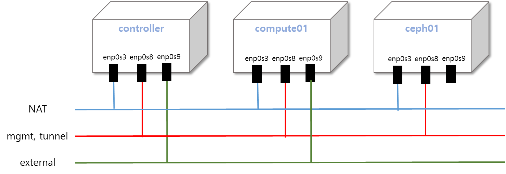

=================================
OpenStack Source INSTALL Features
=================================
* Keystone
* Glance with Ceph Store
* Nova
* Neutron(OVS+L3)
* Horizon
* Cinder with Ceph

=================
Component Diagram
=================

=============
INSTALL GUIDE
=============

1. **Vagrantfile** 의 각 VM의 ip를 개인 VirtualBox 환경에 맞게 수정해 준다.

.. code-block:: bash

    v.vm.network "private_network", ip: "192.168.99.200"   ### MGMT_IP, TUNNEL_IP
    v.vm.network "private_network", ip: "192.168.56.200"  ### EXTERNAL_IP

2. **Vagrantfile** 에서 **Ceph** 의 **OSD** 에 사용될 추가 volume file의 위치를 지정해 준다. (Vagrantfile과 같은 디렉토리 위치로 설정해 주면 된다.)

.. code-block:: bash

    sdc = 'C:\Users\sjhan\git\vagrant-openstack\sdc.vdi'
    sdd = 'C:\Users\sjhan\git\vagrant-openstacksdd.vdi'
    sde = 'C:\Users\sjhan\git\vagratn-openstack\sde.vdi'

3. env directory의 **environment-contorller, environment-compute.txt** 의  **variables** 를 설치된 Virtualbox 환경에 맞게 수정

.. code-block:: bash

    ## source this file in controller
    export MGMT_HOSTNAME="dev-controller"
    export MGMT_IP="192.168.99.100"
    export CEPH_HOSTNAME="dev-ceph01"
    export HOSTNAME=`hostname -s`
    export MY_IP="192.168.99.200"
    export TUNNEL_IP="192.168.56.202"

    export MYSQL_PASS="password"
    export SERVICE_PASS="password"
    export RABBIT_PASS="password"
    export ADMIN_PASS="password"
    export DEMO_PASS="password"

    export OS_TOKEN=`openssl rand -hex 10`
    export OS_URL=http://$MGMT_HOSTNAME:35357/v3
    export OS_IDENTITY_API_VERSION=3

    export GIT_URL="http://git.openstack.org/openstack/"  ###if upstream - http://git.openstack.org/openstack/

.. code-block:: bash

    ## source this file in compute node
    export MGMT_HOSTNAME="dev-controller"
    export MGMT_IP="192.168.99.200"
    export CEPH_HOSTNAME="dev-ceph01"
    export HOSTNAME=`hostname -s`
    export MY_IP="192.168.99.202"
    export TUNNEL_IP="192.168.56.202"

    export MYSQL_PASS="password"
    export SERVICE_PASS="password"
    export RABBIT_PASS="password"
    export ADMIN_PASS="password"
    export DEMO_PASS="password"

    export GIT_URL="http://git.openstack.org/openstack/"
    export SECRET_UUID="457eb676-33da-42ec-9a8c-9293d545c337"

4. **common_script** 의  **hosts** 파일을 수정

.. code-block:: bash

    cat > /etc/hosts <<EOF
    127.0.0.1         localhost
    192.168.99.200    dev-controller
    192.168.99.201    dev-ceph01
    192.168.99.202    dev-compute01
    EOF
